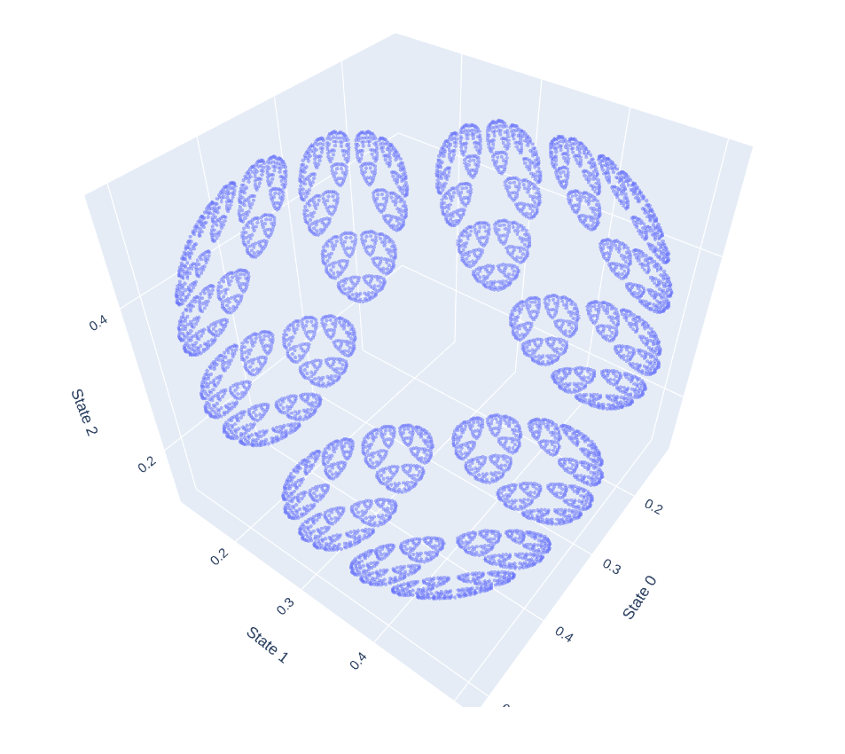

Exercises for the Computational Mechanics module at Iliad Intensive 2026.

Verify correctness via `uv run core-exercises.py`. Interactive 3d plot at <https://lumi-a.github.io/generalised-hidden-markov-models/beliefstate.html>.

## Exercises Probability

1. Using your programming language of choice, implement a function that takes in:  
   1. The transition matrices of a GHMM (a three-tensor)  
   2. The initial vector   
   3. A sequence of tokens

	and outputs the probability of observing that particular sequence of tokens. 

2. Test your function on the random-random-XOR (RRXOR) process when initialised in the state η(∅) \= \[1 0 0 0 0\]. Make sure you assign zero probability to XOR violations.    
3. Convince yourself that that the definition of a GHMM allows one to interpret η(∅)T(w1)T(w2)...T(wn)ϕ as the probability of emitting the sequence w1 w2 … wn.

## Exercises Prediction

1. Using your programming language of choice, implement a function that takes in:  
   1. The transition matrices of a GHMM (a three-tensor)  
   2. The initial vector   
   3. A sequence of tokens

	and outputs the corresponding: belief state and next-token (prediction) vector.

2. Test your function on the zero-one-random (Z1R) process when initialised in the state η(∅) \= \[1/3 1/3 1/3\], and compare to the results of the worked example on [Slide 12](https://14xp.github.io/assets/slides/CompMechSlidesPt3.pdf).   
3. Visualise belief state geometry and the next-token geometry for the [Mess3 p	rocess](https://github.com/Astera-org/simplexity/blob/main/simplexity/generative_processes/transition_matrices.py) initialised in the uniform distribution. Does it look like the theoretical prediction in Fig. 1 of [Shai et al](https://arxiv.org/pdf/2405.15943)?
